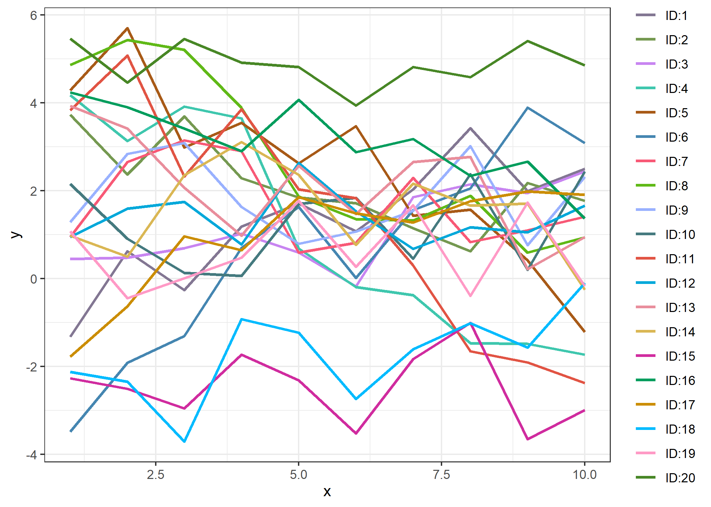

<!-- README.md is generated from README.Rmd. Please edit that file -->

# HalPalR

An R package for generating color palettes using Halton sequences in CIE
L*a*b\* color space. Based on
[halpal.py](https://github.com/wiedenhoeft/HalPal) by John Wiedenhoeft.

## Installation

To install from GitHub:

``` r
require(remotes)
remotes::install_github("benjaminrich/HalPalR")
```

## Examples

``` r
library(HalPalR)
library(ggplot2)

n <- 20
barplot(rep(1, n), col=halpal(n), space=0, border=NA, axes=FALSE)
```

<!-- -->

``` r

n <- 20
set.seed(123)
intercept <- runif(n, -5, 5)
slope <- -(intercept/5)*runif(n, 0, 1)
dat <- expand.grid(ID=paste0("ID:", 1:n), x=1:10)
dat$y <- intercept + dat$x*slope + runif(nrow(dat), 0, 3)
ggplot(dat, aes(x=x, y=y, color=ID)) + geom_line(size=1) +
  scale_color_halpal() + theme_bw()
```

<!-- -->
